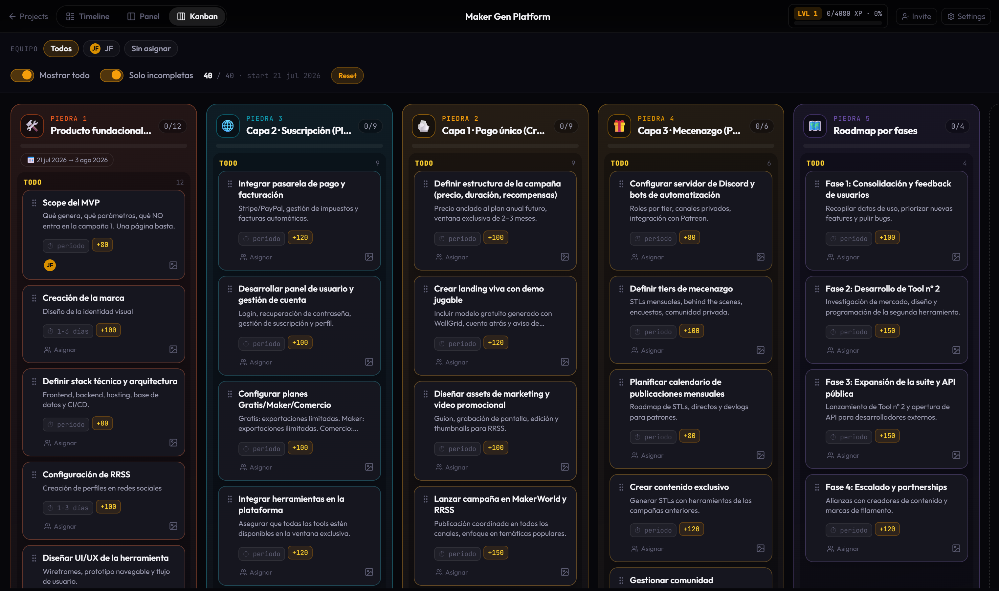
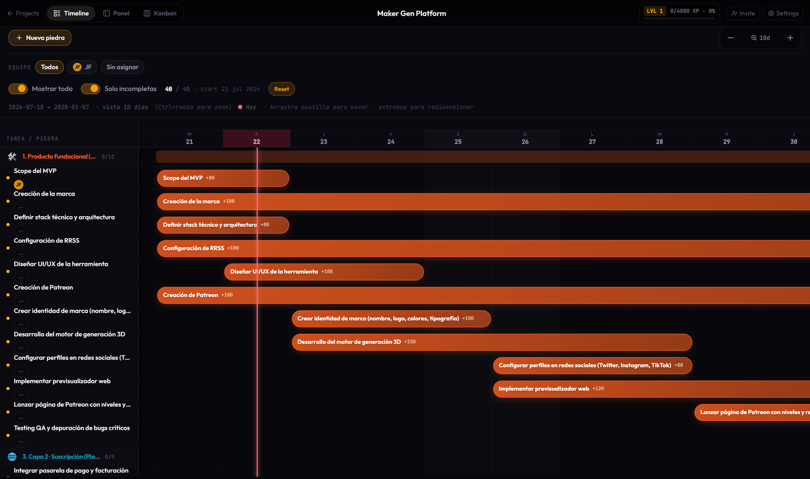
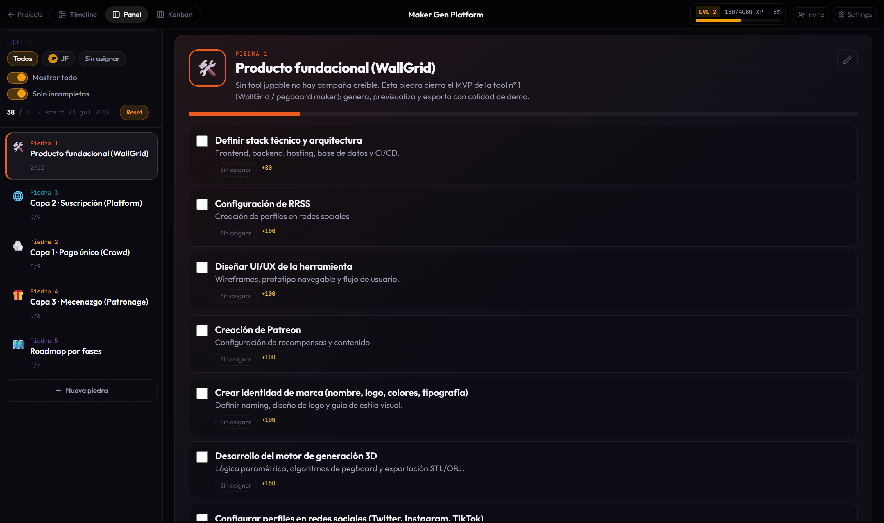

# Piedra a Piedra

Gamified multi-project roadmap: **stones** (milestones), **XP tasks**, **Kanban / Timeline / Panel**, native **`.stones`** format, and optional **NVIDIA NIM** AI edits under review.

Invite-only access · React + Supabase + Vercel

---

## Choose your language / Elige idioma

| Language | README | Deploy |
|----------|--------|--------|
| **English** | [docs/en/README.md](./docs/en/README.md) | [docs/en/DEPLOY.md](./docs/en/DEPLOY.md) |
| **Español** | [docs/es/README.md](./docs/es/README.md) | [docs/es/DEPLOY.md](./docs/es/DEPLOY.md) |

Full docs folder index: **[docs/README.md](./docs/README.md)**

---

## Board views / Vistas del board

| Kanban | Timeline | Panel |
|--------|----------|-------|
|  |  |  |

---

## Quick links

- **[English README](./docs/en/README.md)** — features, setup, AI
- **[README en español](./docs/es/README.md)** — características, setup, IA
- **[Deploy (EN)](./docs/en/DEPLOY.md)** · **[Deploy (ES)](./docs/es/DEPLOY.md)**
- **In-app docs:** `/docs` · `/docs/stones` · `/docs/ai`

## Stack

React 19 · Vite · Tailwind · Supabase (Auth, Postgres, Storage, RLS) · Vercel serverless · NVIDIA NIM (optional)

## License

Free for forks and self-hosting. Non-commercial usage.
