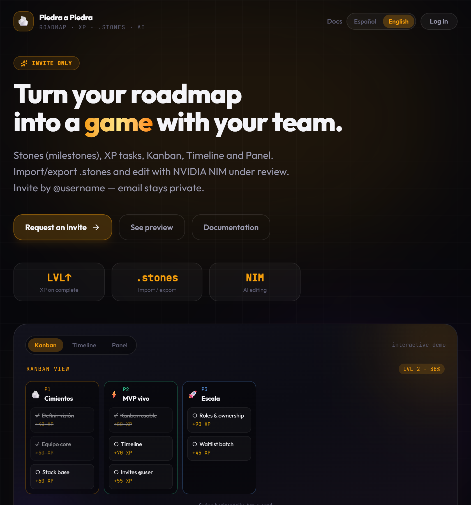

# Piedra a Piedra

**[Español →](../es/README.md)** · **[Deploy (EN)](./DEPLOY.md)** · **[Docs index](../README.md)** · **[Repo hub](../../README.md)**

Gamified multi-project roadmap: milestones (**stones**), tasks with **XP**, three board views, native **`.stones`** text format, and optional **NVIDIA NIM** AI editing with a controlled diff.



---

## Features

- **Invite-only** access (waitlist + platform invites; no public sign-up)
- **@username** identity (email stays private on the board)
- **Multi-project** hub with roles: owner / admin / member
- **Stones & tasks**: color, dates, assignees, images, XP
- **Views**: Kanban, Timeline, Panel (same board)
- **`.stones`**: human-readable import/export (templates, backups, git)
- **NVIDIA NIM AI** (optional): edit the roadmap with free LLMs, review **New / Changes / Removed**, apply only what you accept
- **i18n**: Spanish & English (browser auto-detect)

### Board views

| Kanban | Timeline | Panel |
|--------|----------|-------|
|  |  |  |

---

## Stack

| Layer | Tech |
|-------|------|
| Frontend | React 19, Vite, Tailwind 4, Lucide, dnd-kit |
| Backend | Supabase (Auth, Postgres, RLS, Storage) |
| Hosting | Vercel (or Netlify) |
| AI (optional) | NVIDIA NIM via `/api/nim-chat` proxy |

---

## Quick start (local)

1. Create a Supabase project and run SQL in `scripts/supabase/` (see `scripts/README.md` and [DEPLOY.md](./DEPLOY.md)).
2. Configure env:

```bash
cd web
cp .env.example .env.local
# VITE_SUPABASE_URL=...
# VITE_SUPABASE_PUBLISHABLE_KEY=sb_publishable_...
npm install
npm run dev
```

3. Open [http://localhost:5173](http://localhost:5173)

> **NVIDIA NIM in dev:** Vite serves `POST /api/nim-chat` through `web/vite-plugin-nim-api.js` (avoids CORS). Restart `npm run dev` after pulling that plugin.

---

## Deploy & platform admin

See **[DEPLOY.md](./DEPLOY.md)** — fork → Supabase → Vercel/Netlify.

**Admin (summary):** do not invite the admin by email. In Supabase → Authentication → Users → **Add user** with email + password (Auto Confirm). Then SQL (`004_setup_admin.sql`): `is_platform_admin = true`, `username_setup_done = true`. Sign in at `/login`.

---

## `.stones` format

Plain-text markup for roadmaps (no JSON/YAML required):

```text
# Modelo: Product launch
> From idea to market

@meta
start: 2026-08-01
end: 2026-11-30

═══════════════════════════════════════════════════════════════
PIEDRA 1 · Foundation
icon: 🪨
color: #f59e0b
═══════════════════════════════════════════════════════════════

Short description…

### Tareas

- [ ] Define value proposition
  xp: 100
  notas: One clear sentence.
```

- **Import:** Projects hub → Import `.stones`
- **Export:** Project settings → Export `.stones`
- **In-app docs:** `/docs/stones`

---

## NVIDIA NIM (AI edit)

1. Profile → **NVIDIA NIM** → paste API key from [build.nvidia.com](https://build.nvidia.com/settings/api-keys)
2. In a project, open **Edit with AI**
3. Prompt + model (+ `@piedra1` / `@piedra1#task` mentions)
4. Review diff (**New / Changes / Removed**) → include/exclude → apply

The API key is stored **only in the browser** (localStorage). The board is sent as `.stones`; nothing is saved until you confirm.

Curated models include Llama 3.2 3B, Nemotron Nano, Gemma 7B, Llama 3.3 70B, Qwen3.5 122B, GLM 5.2, Nemotron Ultra, and more (see in-app `/docs/ai` or `web/src/lib/nimModels.js`).

---

## Project structure

```
piedra-a-piedra/
├── web/                    # React app (Vite)
│   ├── src/pages/          # Landing, product docs, projects, workspace
│   ├── src/components/
│   └── vite-plugin-nim-api.js
├── api/                    # Vercel serverless (invite, waitlist, nim-chat)
├── scripts/supabase/       # Schema, RLS, storage, admin
├── docs/
│   ├── README.md           # This docs folder index
│   ├── images/             # Screenshots
│   ├── en/                 # English (README, DEPLOY, …)
│   └── es/                 # Español (README, DEPLOY, …)
└── README.md               # Language hub at repo root
```

---

## In-app product docs

| Path | Content |
|------|---------|
| `/docs` | Documentation hub |
| `/docs/start` | Getting started |
| `/docs/stones` | `.stones` format |
| `/docs/ai` | NVIDIA NIM guide |
| `/docs/workspace` | Kanban / Timeline / Panel |
| `/docs/team` | Invites & roles |

---

## License

Free for forks and self-hosting. Non-commercial usage.
