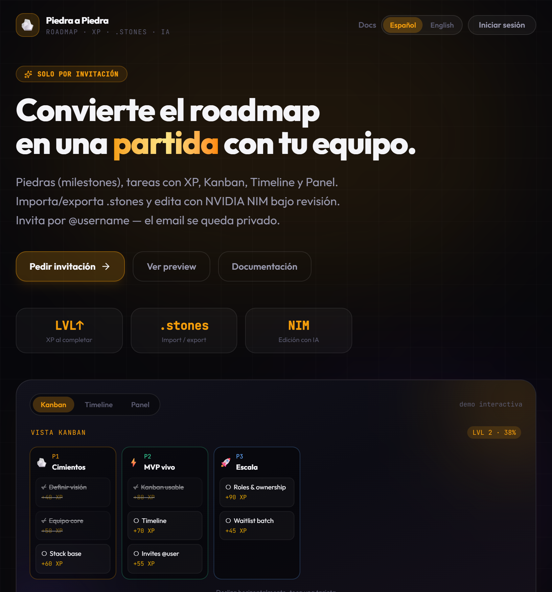

# Piedra a Piedra

**[English →](../en/README.md)** · **[Deploy (ES)](./DEPLOY.md)** · **[Índice docs](../README.md)** · **[Hub del repo](../../README.md)**

Roadmap multi‑proyecto gamificado: hitos (**piedras**), tareas con **XP**, tres vistas del board, formato nativo **`.stones`** y edición opcional con **NVIDIA NIM** bajo revisión controlada.



---

## Características

- Acceso **solo por invitación** (lista de espera + invites de plataforma; sin registro público)
- Identidad por **@username** (el email no se muestra en el board)
- Hub **multi‑proyecto** con roles: owner / admin / member
- **Piedras y tareas**: color, fechas, asignados, imágenes, XP
- **Vistas**: Kanban, Timeline, Panel (mismo board)
- **`.stones`**: texto legible para importar/exportar (plantillas, backups, git)
- **IA con NVIDIA NIM** (opcional): edita el roadmap con LLMs free, revisa **Nuevo / Cambios / Eliminado** y aplica solo lo que aceptes
- **i18n**: español e inglés (detección automática del navegador)

### Vistas del board

| Kanban | Timeline | Panel |
|--------|----------|-------|
|  |  |  |

---

## Stack

| Capa | Tecnología |
|------|------------|
| Frontend | React 19, Vite, Tailwind 4, Lucide, dnd-kit |
| Backend | Supabase (Auth, Postgres, RLS, Storage) |
| Hosting | Vercel (o Netlify) |
| IA (opcional) | NVIDIA NIM vía proxy `/api/nim-chat` |

---

## Arranque rápido (local)

1. Crea un proyecto Supabase y ejecuta el SQL de `scripts/supabase/` (ver `scripts/README.md` y [DEPLOY.md](./DEPLOY.md)).
2. Configura el entorno:

```bash
cd web
cp .env.example .env.local
# VITE_SUPABASE_URL=...
# VITE_SUPABASE_PUBLISHABLE_KEY=sb_publishable_...
npm install
npm run dev
```

3. Abre [http://localhost:5173](http://localhost:5173)

> **NVIDIA NIM en local:** Vite sirve `POST /api/nim-chat` con `web/vite-plugin-nim-api.js` (evita CORS). Reinicia `npm run dev` tras actualizar ese plugin.

---

## Deploy y admin de plataforma

Ver **[DEPLOY.md](./DEPLOY.md)** — fork → Supabase → Vercel/Netlify.

**Admin (resumen):** no se invita al admin por email. En Supabase → Authentication → Users → **Add user** con email + contraseña (Auto Confirm). Luego SQL (`004_setup_admin.sql`): `is_platform_admin = true`, `username_setup_done = true`. Entrar en `/login`.

---

## Formato `.stones`

Marcaje de texto plano para roadmaps (sin JSON ni YAML):

```text
# Modelo: Lanzamiento de producto
> Del concepto al mercado

@meta
start: 2026-08-01
end: 2026-11-30

═══════════════════════════════════════════════════════════════
PIEDRA 1 · Fundación
icon: 🪨
color: #f59e0b
═══════════════════════════════════════════════════════════════

Descripción corta…

### Tareas

- [ ] Definir propuesta de valor
  xp: 100
  notas: Una frase clara.
```

- **Importar:** Hub de proyectos → Importar `.stones`
- **Exportar:** Ajustes del proyecto → Exportar `.stones`
- **Docs en la app:** `/docs/stones`

---

## NVIDIA NIM (editar con IA)

1. Perfil → **NVIDIA NIM** → pega la API key de [build.nvidia.com](https://build.nvidia.com/settings/api-keys)
2. En un proyecto, abre **Editar con IA**
3. Prompt + modelo (+ menciones `@piedra1` / `@piedra1#tarea`)
4. Revisa el diff (**Nuevo / Cambios / Eliminado**) → incluir/excluir → aplicar

La API key se guarda **solo en el navegador** (localStorage). El board se envía como `.stones`; no se guarda nada hasta que confirmas.

Modelos curados: Llama 3.2 3B, Nemotron Nano, Gemma 7B, Llama 3.3 70B, Qwen3.5 122B, GLM 5.2, Nemotron Ultra, etc. (ver en la app `/docs/ai` o `web/src/lib/nimModels.js`).

---

## Estructura del proyecto

```
piedra-a-piedra/
├── web/                    # App React (Vite)
│   ├── src/pages/          # Landing, docs de producto, proyectos, workspace
│   ├── src/components/
│   └── vite-plugin-nim-api.js
├── api/                    # Serverless Vercel (invite, waitlist, nim-chat)
├── scripts/supabase/       # Schema, RLS, storage, admin
├── docs/
│   ├── README.md           # Índice de esta carpeta
│   ├── images/             # Capturas
│   ├── en/                 # English (README, DEPLOY, …)
│   └── es/                 # Español (README, DEPLOY, …)
└── README.md               # Hub de idiomas en la raíz
```

---

## Documentación en la app

| Ruta | Contenido |
|------|-----------|
| `/docs` | Índice de guías |
| `/docs/start` | Primeros pasos |
| `/docs/stones` | Formato `.stones` |
| `/docs/ai` | Guía NVIDIA NIM |
| `/docs/workspace` | Kanban / Timeline / Panel |
| `/docs/team` | Invitaciones y roles |

---

## Licencia

Uso libre para forks y self-hosting. Para uso no comercial.
